# E-COMMERCE ECOSYSTEM


<br>

# PROJECT INTRODUCTION

This project simulates an e-commerce ecosystem that includes a gaming-themed website called **LEVEL UP**, and a **Bank** to handle all financial transactions. The website allows users to purchase gaming products based on their experience level, starting with beginner items like gaming mice, keyboards, and controllers, progressing to intermediate products like gaming displays, and finally advanced equipment such as VR headsets and steering wheels.

The system supports both suppliers and customers. Suppliers can create accounts, add their products, and supply them to customers. Customers can browse and purchase products while making payments through the integrated bank system. After a purchase, suppliers fulfill the orders and pay 20% of their earnings to the e-commerce platform as a commission. Both suppliers and customers must link their bank accounts during signup to facilitate transactions.

The **Bank** operates as a separate entity, managing all transactions between the parties. Users can log in to the bank system to view their transaction history, including credits and debits. All interactions between the e-commerce platform, suppliers, and the bank are carried out using APIs, ensuring smooth functionality across the ecosystem.

This project focuses on simulating the core functionality of an e-commerce system, showcasing the interaction between users, suppliers, and a bank in an organized setup.

<br>
<br>

## Technologies Used  

### Frontend  
-  **HTML**: To structure the web content.
-  **CSS**: For styling the web project.
-  **React.js**: For building the user interface of the e-commerce website.
-  **React Router**: For declarative routing in React applications.
-  **Tailwind CSS**: A utility-first CSS framework for designing responsive and modern UI components.  
-  **DaisyUI**: A Tailwind CSS-based UI framework to enhance styling with prebuilt components.  

### Backend  

-  **Node.js**: To handle server-side logic and API integration.  
-  **Express.js**: For creating and managing backend services and APIs.  
-  **JSON Web Token (JWT)**: To secure user authentication and authorization.  

### Database  

-  **MongoDB**: A NoSQL database for managing user, product, and transaction data.  

<br>


# Activity Diagram

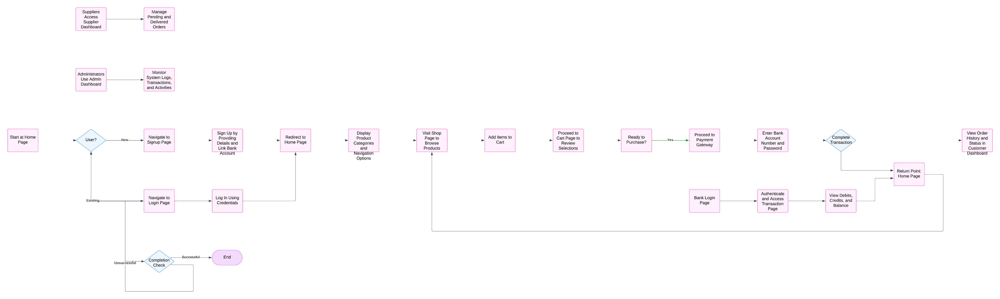

<br>

# Core Features

<br>

# LEVEL UP 

## 1. **Authentication**  
- **Login & Signup**: Secure user registration and login for customers, suppliers, admins, and bank users.  
- **Session Management**: Protect all user sessions and API access with JWT authentication.  

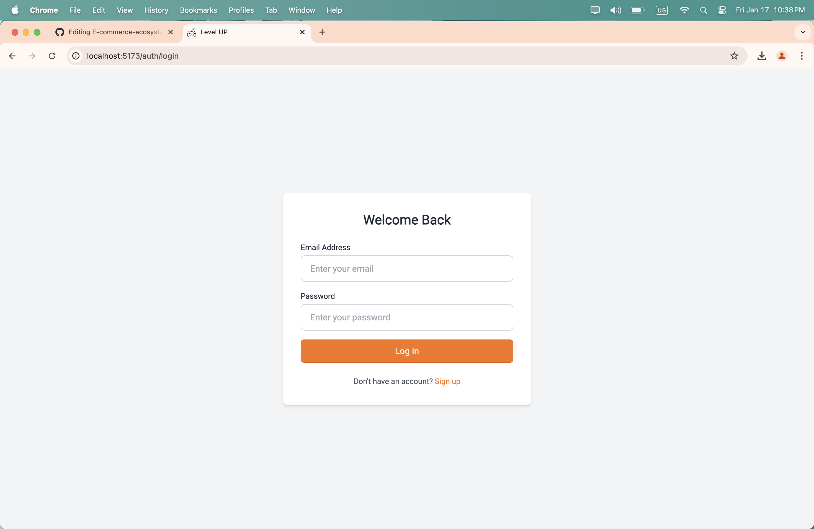  
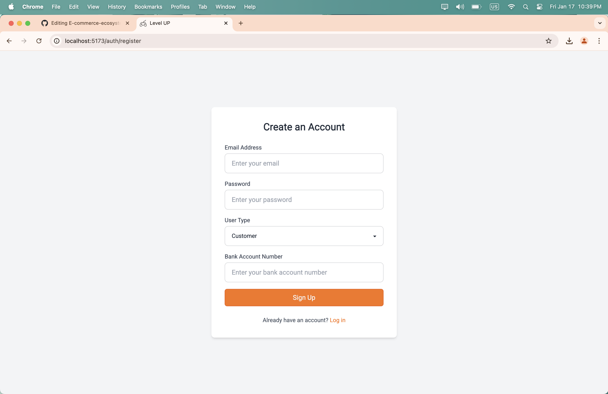  

## 2. **Home Page**  
- **Product Showcase**: Displays all available products categorized by user experience level (Beginner, Intermediate, Expert).  
- **Responsive Design**: User-friendly interface across all devices.  

  

## 3. **Shop Page**  
- **Product Browsing**: Logged-in customers can view and select products for purchase.  
- **Product Details**: Includes price, description, and quantity options.  

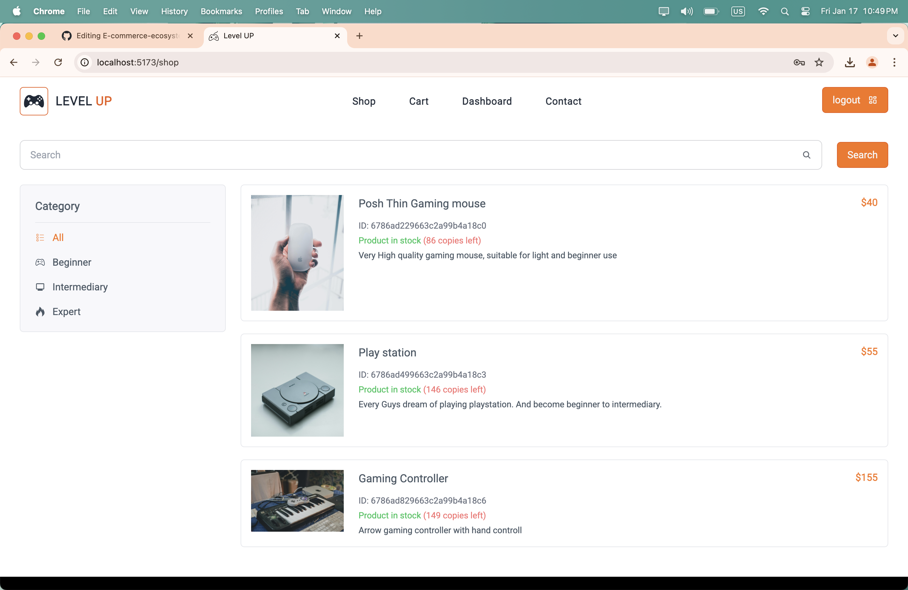 

## 4. **Product Page**  
- **Product View & Add to cart**: View product in detail and add to cart

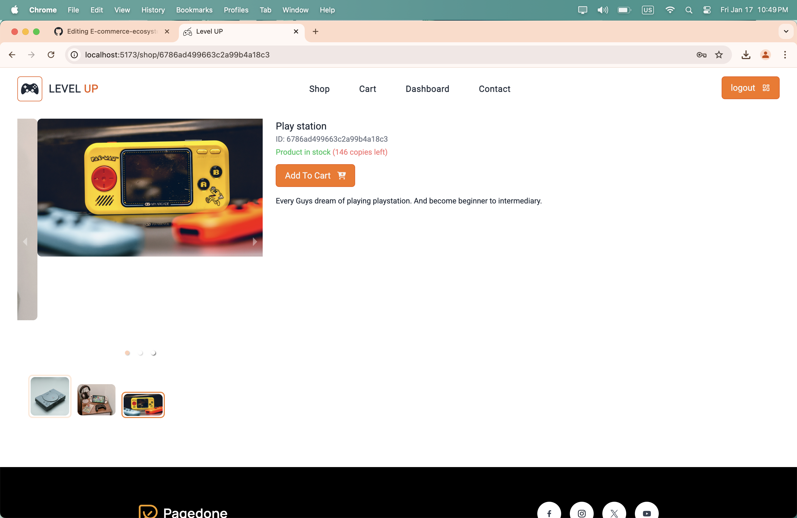 

## 5. **Cart Management**  
- **Cart Page**: Shows all items added to the cart with options to update quantity or remove items.  

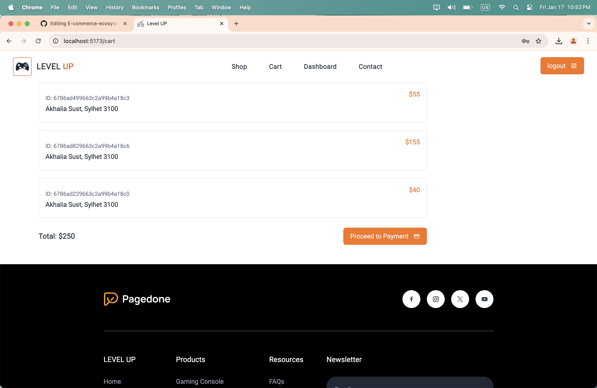  

## 6. **Payment Gateway**  
- **Bank Integration**: Customers enter their bank number and password to complete purchases securely.  
- **Transaction Validation**: Ensures funds are debited correctly, with a success or failure message displayed to the user.  

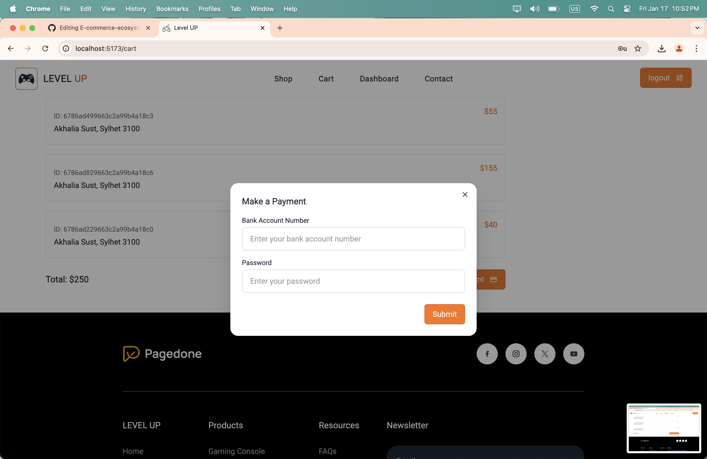  

## 7. **Dashboards**  

### Customer Dashboard  
- **Order History**: Displays all purchased products with status (Pending or Delivered).  

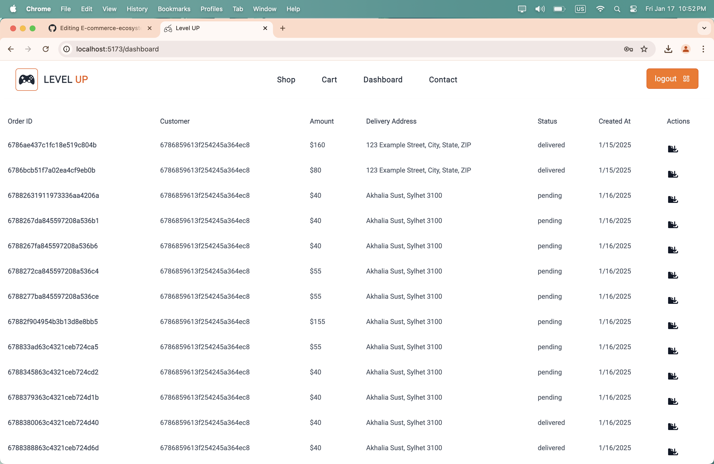  

### Supplier Dashboard  
- **Order Management**: Shows all pending and delivered orders for the supplier.  

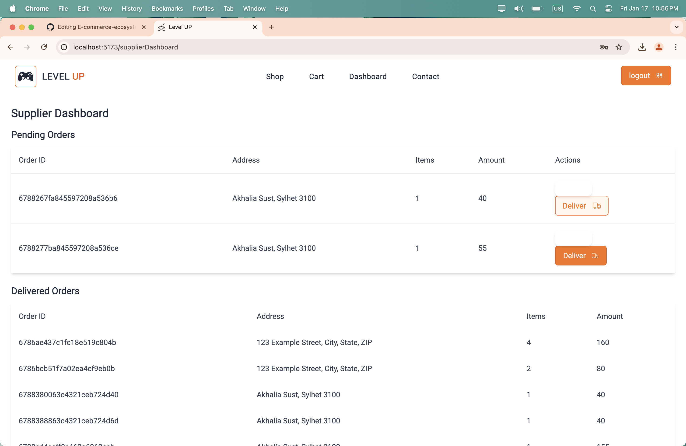  

### Admin Dashboard  
- **System Logs**: Displays all transactions, user activity, and system interactions for monitoring.  

  

<br>

# AIA BANK

The **Bank** is a seperate identity, access it via **/bank** address, example **http://localhost:5173/bank**.

## 8. **Bank System**  

### Bank Login Page  
- **User Access**: Secure login for bank account holders.  

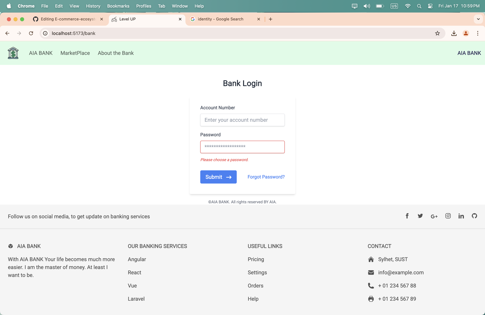  

### Transaction Page  
- **Transaction History**: Displays all debits, credits, and current balance for the logged-in user.  

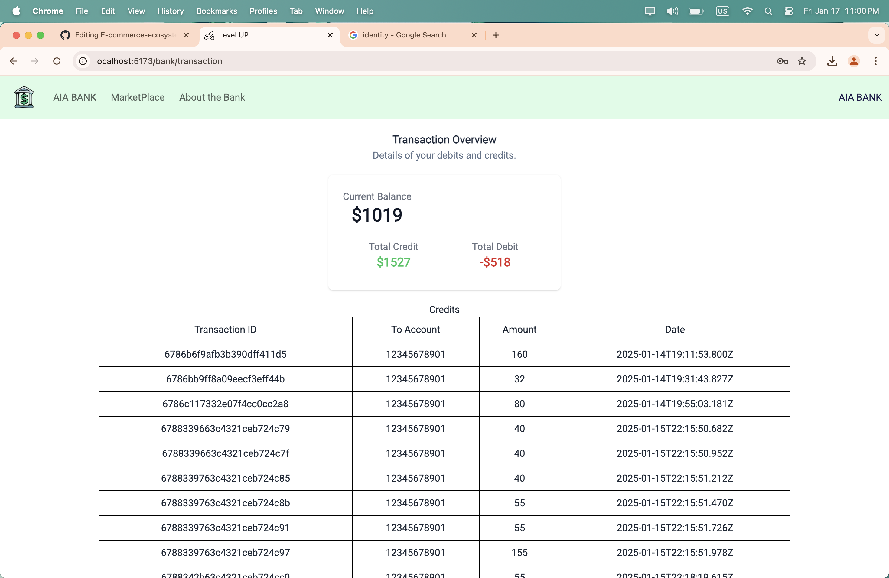  

<br>

# Database Schema

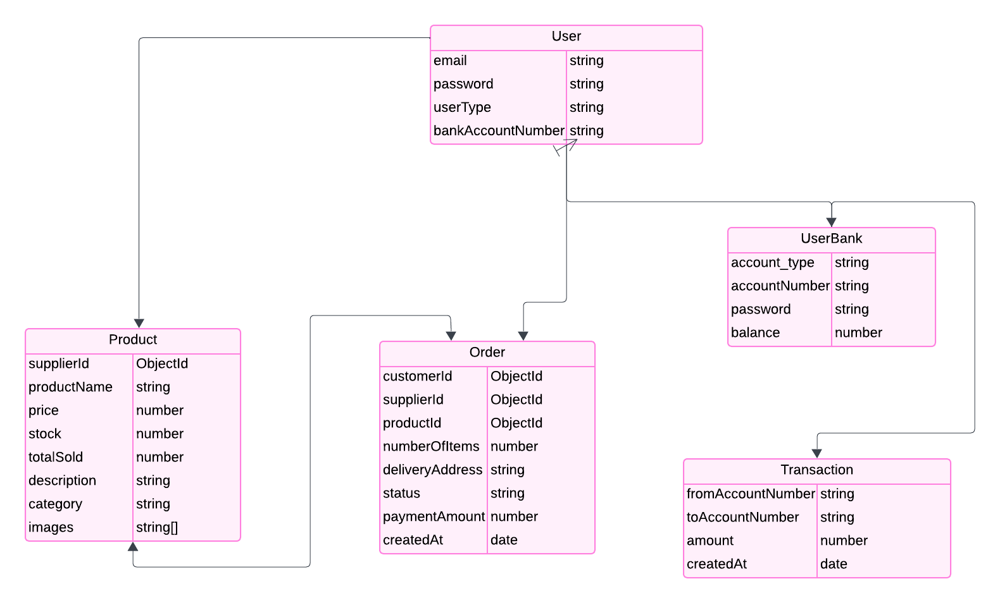 

<br>


# Manual Setup 🧑‍💻

Clone this repo and create a `.env` file at the backend folder

```
PORT=8000
JWT_SECRET=
MONGO_DB=
```

Create `customer` or `supplier` type of user using the system. Create `admin` type of user, using the `signup` api and manually entering user type as `admin`.
Start using the system.

## Backend:

1. Navigate to the backend directory:
   ```bash
   cd backend
   ```

2. Install dependencies:
   ```bash
   npm install
   ```

3. Start the development server:
   ```bash
   npm run dev
   ```

## Frontend:

1. Navigate to the frontend directory:
   ```bash
   cd frontend
   ```

2. Install dependencies:
   ```bash
   npm install
   ```

3. Start the development server:
   ```bash
   npm run dev
   ```

